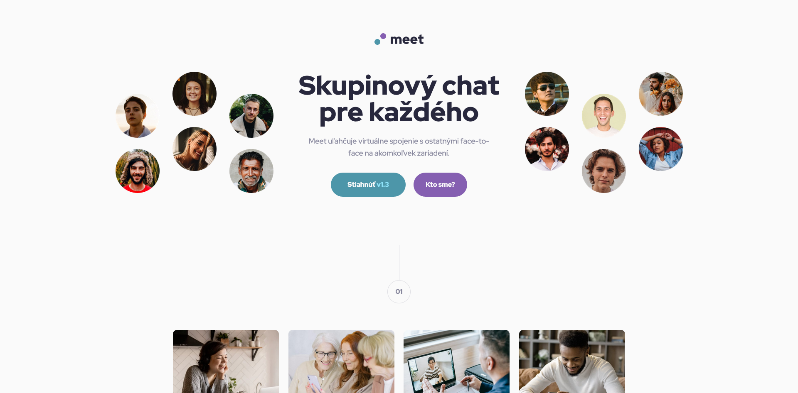
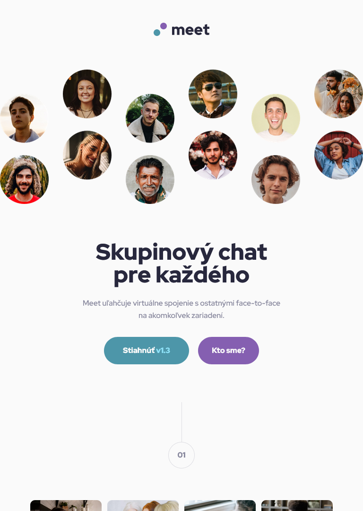
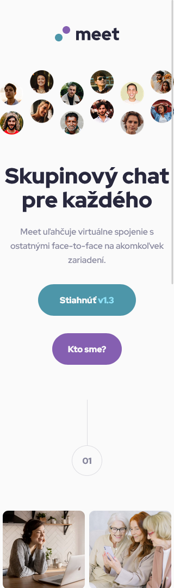

# Frontend Mentor - meet landing page

## 📝 Informácie o projekte

Tento projekt je zo stránky [Frontend Mentor](https://www.frontendmentor.io/challenges/meet-landing-page-rbTDS6OUR). Je to "landing page" s responzívnym dizajnom pre desktop, tablet a mobil.

Stránka Frontend Mentor ponúka projekty na vypracovanie, ktoré obsahujú základný text v HTML a grafický dizajn projektu. Predlohy projektov sú dostupné vo Figme.

## 🏗️ Vytvorenie projektu

Projekt som vytvoril približne za 5 hodín (čas od stiahnutia projektu až po jeho finálne publikovanie na stránke Frontend Mentor). Použil som HTML,CSS a Sass. Projekt má dizajn pre pre desktop, tablet a mobil. Anglické texty som upravil na slovenské.

#### [Odkaz na hotovú stránku](https://tomasdunik.github.io/frontend-mentor__meet-landing-page/)

## 🛠️ Vytvorené s

- HTML
- CSS
- SCSS
- Mobile First

## 📸 Screenshots

### 💻 Desktop

### 📱 Tablet

### 📱 Mobil

## 🔗 Projekty Frontend Mentor

- [Tento konkrétny projekt na stránke Frontend Mentor](https://www.frontendmentor.io/solutions/my-version-meet-landing-page-SRSXdcY85E)
- [Moje ostatné projekty na stránke Frontend Mentor](https://www.frontendmentor.io/profile/WeekendsProgrammer)
